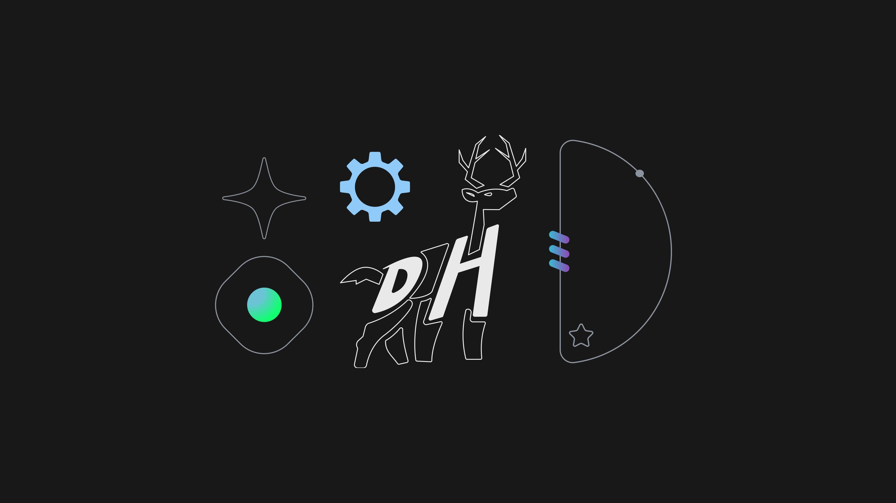

# DeerHacks

[](https://deerhacks.ca)

> DeerHacks Hackathon 2026 Dashboard

[](https://app.netlify.com/sites/deerhacks/deploys)
[](https://deerhacks.ca)

## Open Source & Attribution

This project is an open source archive of the DeerHacks Website & Dashboard and is licensed under the [GPL v3.0 License](LICENSE). We also ask that you keep the footer attribution to the original creators if you decide to use this project for any derivative works.

## Setup

1. Run `npm install` to install dependencies
2. Install all the required workspace `@recommended` extensions
3. Add the required `.env.local` file (see format below)

## Getting Started

First, run the development server:

```bash
npm run dev
```

Open [http://localhost:3000](http://localhost:3000) with your browser to see the result.

### Going Full Stack

The DeerHacks dashboard leverages the [DeerHacks Backend](https://github.com/utmmcss/deerhacks-backend) and [DeerHacks CMS](https://github.com/utmmcss/deerhacks-cms) to provide a full stack experience. To get started, follow the instructions in the respective repositories.

Ensure that the ports and environments are configured to work with each other.

## Discord OAuth2 Configuration

The frontend redirects users to Discord for authentication. The OAuth2 URL configuration is critical.

### Required OAuth2 Scopes

The `NEXT_PUBLIC_DISCORD_OAUTH2_URL` **must** include these scopes:

| Scope | Purpose |
|-------|---------|
| `identify` | Read user's Discord ID, username, avatar |
| `email` | Read user's email address |
| `guilds.join` | **Required** for backend to add users to Discord server |

### OAuth2 URL Format

```
https://discord.com/oauth2/authorize?client_id=YOUR_CLIENT_ID&redirect_uri=YOUR_CALLBACK_URL&response_type=code&scope=identify+email+guilds.join
```

**Important Notes:**
- The `redirect_uri` must be URL-encoded (e.g., `http%3A%2F%2Flocalhost%3A3000%2Flogin%2Fcallback`)
- The `redirect_uri` must be registered in Discord Developer Portal → OAuth2 → Redirects
- Use `+` or `%20` to separate scopes (both work)

### Common Issue

If users can log in but don't get added to the Discord server, check that `guilds.join` is in the OAuth URL. The backend will log:
```
AddToDiscord failed (status 403). Response body: {"message": "Missing required OAuth2 scope", "code": 50026}
```

**Fix:** Add `guilds.join` to the OAuth URL. Existing users must log out and back in to get a new token with the updated scopes.

## Environment Variables

Create a `.env.local` file:

```bash
# Backend API URL
NEXT_PUBLIC_DEERHACKS_BASE_URL=http://localhost:8080

# Discord OAuth2 URL (MUST include guilds.join scope!)
# Development:
NEXT_PUBLIC_DISCORD_OAUTH2_URL=https://discord.com/oauth2/authorize?client_id=YOUR_CLIENT_ID&redirect_uri=http%3A%2F%2Flocalhost%3A3000%2Flogin%2Fcallback&response_type=code&scope=identify+email+guilds.join

# Production example:
# NEXT_PUBLIC_DISCORD_OAUTH2_URL=https://discord.com/oauth2/authorize?client_id=YOUR_CLIENT_ID&redirect_uri=https%3A%2F%2Fdeerhacks.ca%2Flogin%2Fcallback&response_type=code&scope=identify+email+guilds.join

# Feature toggles
NEXT_PUBLIC_TOGGLE_DASHBOARD=true
NEXT_PUBLIC_TOGGLE_SIGNUP_HACKER=true
NEXT_PUBLIC_TOGGLE_HACKER_PACK=true
```

### Getting Your Client ID

1. Go to [Discord Developer Portal](https://discord.com/developers/applications)
2. Select your application
3. Copy the **Application ID** (this is your Client ID)

### Registering Redirect URIs

1. Go to Discord Developer Portal → Your App → OAuth2 → Redirects
2. Add your redirect URLs:
   - `http://localhost:3000/login/callback` (development)
   - `https://yourdomain.com/login/callback` (production)

## Testing

Run the commands to catch any linting / type errors:

```bash
npm run lint
npm run check-types
```

These commands are run before pushing with `husky` and in our CI/CD pipeline with `GitHub Actions`.
